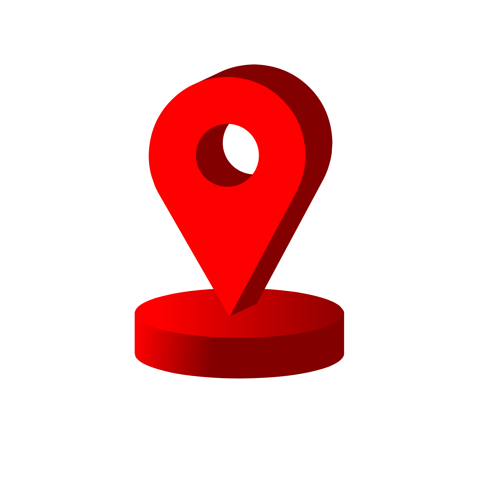
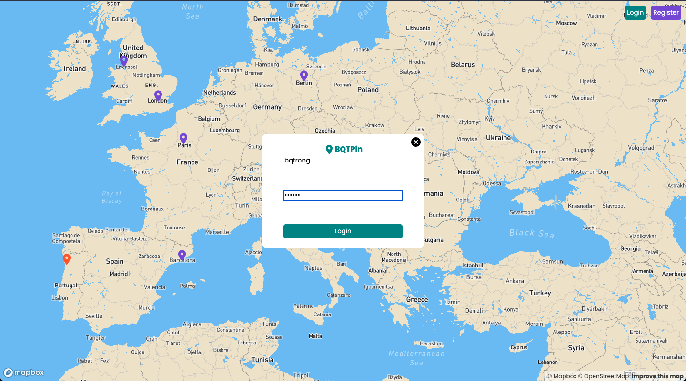

# MERN-Travel-Map

<!-- PROJECT LOGO -->
 

  

  <h3 align="center">Travel Map Pin</h3>

  

    A single page application built with MERN Stack from scratch (MongoDB + Mongoose, Express, React & NodeJs)
  

<!-- TABLE OF CONTENTS -->

## Table of Content

  <ol>
    <li>
      <a href="#about-the-project">About The Project</a>
      <ul>
        <li><a href="#built-with">Built With</a></li>
      </ul>
    </li>
    <li>
      <a href="#getting-started">Getting Started</a>
      <ul>
        <li><a href="#prerequisites">Prerequisites</a></li>
        <li><a href="#installation">Installation</a></li>
      </ul>
    </li>
    <li><a href="#usage">Usage</a></li>
    <li><a href="#contributing">Contributing</a></li>
    <li><a href="#contact">Contact</a></li>
  </ol>

<!-- ABOUT THE PROJECT -->

## About The Project

In this application, you can pin your location and share your reviews with other users.

The users can pin their favourite locations on the map to which the users can rate them, write some descripion about that place which other users can see.

Here are some of the basis functions:

- Register

- Login

- Pin a location

- Review & Rating

- Preview all locations on the map

(<a href="#top">back to top</a>)

### Built With

For front end

- [ReactJS v17.0.2](https://reactjs.org/)

For the backend API

- [NodeJS](https://nodejs.org/en/)
- [Express Framework](https://expressjs.com/)
- [Mapbox API](https://www.mapbox.com/)

(<a href="#top">back to top</a>)

<!-- GETTING STARTED -->

## Getting Started

This is an example of how you may give instructions on setting up your project locally.
To get a local copy up and running follow these simple example steps.

### Prerequisites

For the web application to work, you only need to have a knowledge about ReactMapGl. React App using the ReactMapGL component to use mapbox to display a map theme.

ReactMapGl component props that take from MAPBOX are: mapboxApiAccessToken and mapStyle.

Access key and mapStyle can be found once a MapBox account has been created where the access token will be visible at the bottom of the page. Mapstyle token can be found on Mapbox under Tools & resources, where Design in mapbox studio is selected to select a visual design theme and a code is then generated.

<!-- USAGE EXAMPLES -->

## Usage

As the introduction indicated, this is an app where you can register, log in then write a review and rating of places you have visited. Users can go on the app and see other user's comments on the map.

(<a href="#top">back to top</a>)

